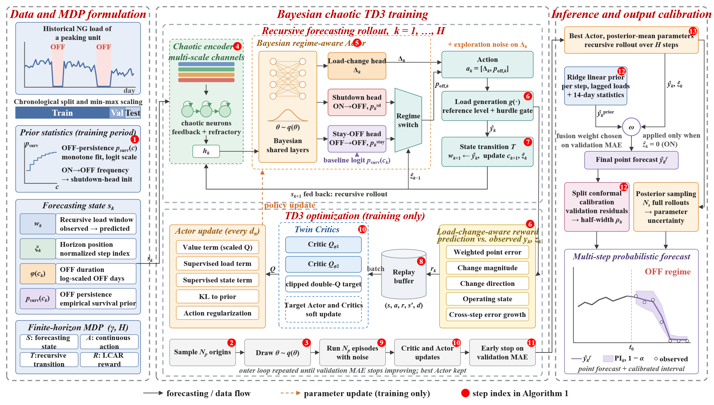

# CBR-TD3: chaos-aware Bayesian reinforcement learning framework with TD3 optimization

Code accompanying the paper:

> **Multi-Step Natural Gas Demand Forecasting for Gas-Fired Peaking Plants: Chaotic State Encoding and
> Transition-Aware Reinforcement Learning** (submitted to *Engineering Applications of Artificial Intelligence*)

Multi-step daily natural gas load forecasting for gas-fired peaking plants is formulated as a finite-horizon
sequential decision process. Each action contains a continuous load adjustment and an OFF probability, and
every prediction updates the recursive state used by the next forecasting step. The framework combines an
endogenous chaotic state encoder, a regime-aware Bayesian actor-critic trained with TD3, a load-change-aware
reward (LCAR), and a validation-selected ridge-regression output fusion.

## 1. Method overview



*Overall framework: data and MDP formulation, Bayesian chaotic TD3 training, and inference with calibrated
prediction intervals. The numbered markers correspond to the steps of Algorithm 1 in the paper.*

The three components are summarized below.

### Sequential forecasting MDP

Each forecasting step predicts a load adjustment and an OFF probability; the prediction then updates the load
window and the operating state used by the next step, so the whole H-day trajectory is generated recursively.

### Endogenous chaotic state encoder

Aihara chaotic neurons with feedback and refractory memory encode multi-scale endogenous load channels
(level, 1/3/7/14-day changes, deviation from the weekly level, and the zero-load state).

### Bayesian regime-aware policy

Variational Bayesian shared layers feed three heads: the load head plus separate shutdown (ON to OFF) and
stay-OFF (OFF to OFF) heads, and posterior sampling provides policy uncertainty.

## 2. Repository layout

| Path | Content |
| --- | --- |
| `model/paper/PAPER.py` | Chaotic encoder, Bayesian actor-critic (TD3), semi-Markov ON/OFF heads, posterior sampling |
| `model/paper/reward.py` | Load-change-aware reward (LCAR) |
| `src/env.py` | Sequential forecasting environment (rollout, state transition, hurdle gate) |
| `src/data_loader.py` | Chronological train/validation/test split, expanding-window walk-forward folds |
| `src/train.py` | Training loop, Adam optimisation, parallel episodes, update-to-data ratio |
| `src/linear_prior.py` | Ridge-regression prior and validation-selected output fusion |
| `src/evaluation.py`, `src/metrics.py` | Point, interval and operating-state metrics, split conformal calibration, DM and block-bootstrap tests |
| `src/artifacts.py`, `src/figures.py`, `src/plot_style.py` | Per-seed metric tables, prediction files, training and forecast figures |
| `run.py`, `config.py` | Command-line entry point and the single source of truth for hyperparameters |
| `tools/dm_test.py` | Paired significance tests for two runs (Diebold-Mariano, moving-block bootstrap, Wilcoxon) |
| `scripts/run_protocol.sh` | The 5 horizons x 5 folds x 5 seeds protocol used in the paper |
| `data/HDQS.xlsx` | Representative samples of the primary series (see Section 3) |

Not included: implementations of the baseline models, the four additional plant datasets, the robustness
campaign, and the tables and figures of the manuscript.

## 3. Data (please read)

The complete operational dataset cannot be released because of confidentiality restrictions.
`data/HDQS.xlsx` contains **the first 500 and the last 500 daily observations** of the primary series, with
the middle section withheld. The file keeps the original one-column layout, so the pipeline runs end to end;
because the sample is discontinuous in time, it is provided **for code verification and for inspection of the
training protocol**, not for reproducing the exact numbers reported in the paper. See `data/README.md`.

To use your own data, pass `--data <file> --col <column>` with a single numeric column of consecutive daily
loads (Excel and CSV are both accepted).

## 4. Installation

Python 3.11 is recommended.

Linux or macOS:

```bash
python -m venv .venv && source .venv/bin/activate
pip install -r requirements.txt
```

Windows (PowerShell):

```powershell
python -m venv .venv
.venv\Scripts\Activate.ps1
pip install -r requirements.txt
```

Everything needed to train and test the released model is contained in this repository, so no file
from the authors' working environment is required; the only optional external input is your own
load series.

Console messages and in-code comments are written in Chinese; options, output files, metric names
and figure labels are in English.

`torch` must match your CUDA driver; install the appropriate build from pytorch.org if the pinned wheel is not
suitable. `psutil` is optional on Linux, where peak process memory falls back to `/proc`; on Windows it should
stay installed, because that fallback does not exist there. On a shared workstation, select a free GPU
explicitly, for example `CUDA_VISIBLE_DEVICES=1 python run.py ...`; otherwise the job may share a card that is
already in use. On Windows the same selection is `$env:CUDA_VISIBLE_DEVICES=1` in PowerShell or
`set CUDA_VISIBLE_DEVICES=1` in the command prompt.

## 5. Quick start

Check the installation with a short run first; on the released sample data it takes about half a
minute and it exercises the full pipeline from loading to figures.

```bash
python run.py --data data/HDQS.xlsx --col HDQS --horizon 1 --seeds 42 --n_folds 1 \
    --total_episodes 1200 --val_every 400 --outdir output/smoke
```

The command prints one metric block per seed and writes `trials_*.csv`, `preds_*.csv`,
`summary_*.csv` and `figures/` inside `output/smoke`; the short budget is only an installation
check, so its accuracy figures are not comparable with the paper. A paper-scale single run then
uses the full training budget:

```bash
python run.py --data data/HDQS.xlsx --col HDQS --horizon 7 --seeds 42 --n_folds 5 \
    --total_episodes 40000 --outdir output/main/HDQS/H7
```

Main options (all defaults reproduce the configuration reported in the paper):

| Option | Meaning |
| --- | --- |
| `--horizon` | forecast horizon (paper: 1, 3, 5, 7, 15 days) |
| `--seq_len` | input window length (default 24 days) |
| `--n_folds` | `1` = single chronological holdout, `K>1` = expanding-window walk-forward folds |
| `--seeds` | comma-separated random seeds (paper: `42,0,1,2,3`); finished seeds are skipped when a run is restarted |
| `--total_episodes`, `--n_parallel`, `--utd` | training budget, parallel episodes, update-to-data ratio |
| `--val_every`, `--patience`, `--min_episodes` | validation interval and early-stopping rule |
| `--pi_method`, `--pi_level` | prediction-interval method and nominal level (paper: split conformal calibration at 95%) |
| `--outdir` | directory for metric tables, predictions and figures |

The prediction intervals reported in the paper are obtained by split conformal calibration on the
validation segment at the 95% nominal level, which is the default (`--pi_method conformal
--pi_level 0.95`, Table B4 of the paper). Intervals from Bayesian posterior sampling are written to
the same prediction files as a reference.

Outputs inside `--outdir`:

- `trials_*.csv` - one row per seed: accuracy, interval and operating-state metrics, efficiency figures and the full configuration fingerprint
- `preds_*.csv` - per-origin predictions with the calibrated prediction interval and the OFF probability
- `summary_*.csv` - mean and standard deviation over seeds
- `figures/` - training curves, validation curves and test-period trajectories (PNG and SVG)

## 6. Protocol used in the paper

```bash
bash scripts/run_protocol.sh                                        # 5 horizons x 5 folds x 5 seeds
PY=/path/to/python bash scripts/run_protocol.sh                     # custom interpreter
```

The script is a POSIX shell script; on Windows run it from Git Bash or WSL, or call `run.py` once per
horizon and fold.

The evaluation protocol is fixed by the code rather than by command-line switches:

- the split is strictly chronological, and min-max scaling, the ridge prior and the conformal calibration are fitted on the training and validation segments only;
- the conformal calibration and the reported interval level are both 95 percent;
- early stopping keeps the checkpoint with the lowest validation MAE and rolls the weights back;
- validation and test origins are constructed inside their own segment, so the complete H-day target sequence of an origin lies inside that segment and the recursive window contains only observations of the same segment;
- the OFF-persistence table used as a state feature is estimated only from training-segment transitions;
- significance between two runs is assessed on the paired daily absolute errors.

## 7. Paired significance tests

```bash
python tools/dm_test.py \
    --a "CBR-TD3=output/main/HDQS/H7" \
    --b "alternative model=output/other/HDQS/H7" \
    --horizon 7 --out output/main/HDQS/dm_H7.csv
```

Both directories must contain `preds_*.csv` files of the same horizon. The script pairs the two runs on their
common forecast origins (multiple seeds are averaged per target day), then reports the Diebold-Mariano
statistic with Newey-West correction at lag `H`, the moving-block bootstrap p value with the 95% percentile
interval of the mean error difference, and the two-sided Wilcoxon signed-rank p value.

The two runs must be trained with a comparable budget. When a run is still weak, the validation
segment may select a fusion weight of zero, in which case the point forecasts reduce to the ridge
prior and two different configurations share the same point errors.

## 8. Environment used in the paper

Two Intel Xeon Platinum 8352Y processors (64 cores), 503 GB RAM, one NVIDIA GeForce RTX 4090 D GPU (24 GB),
Rocky Linux 9.5, Python 3.11.15, PyTorch 2.9.1 with CUDA 12.8. Training one fold and one horizon of the
released configuration takes about 5 minutes (1 day) to 2 hours (15 days) on this machine when a free GPU is
used.

## 9. Citation

Please cite the paper above once the final bibliographic information is available. A BibTeX entry will be
added to this repository after publication.

## 10. Repository

This code is released together with the manuscript at
<https://github.com/Arthur-Z-Lab/gas-demand-forecast-peaking-plants>.

